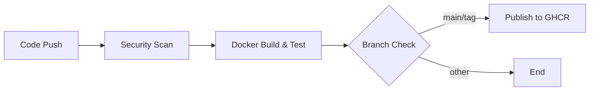

# CI/CD Quick Reference Guide

## 🚀 GitHub Actions Workflow Overview

This repository uses automated CI/CD to ensure code quality, security, and seamless deployment.

### Workflow Triggers

- **Push to `main`**: Full pipeline + GHCR publish
- **Push to `develop`**: Full pipeline (no publish)
- **Pull Requests**: Security scans + build tests
- **Version Tags (`v*`)**: Full pipeline + versioned GHCR publish

### Pipeline Stages



---

## 📋 Jobs Breakdown

### 1️⃣ Security Scan (Always Runs)

**Tools Used:**
- **Black**: Code formatting
- **isort**: Import sorting
- **Flake8**: Linting (syntax errors)
- **Pylint**: Code analysis (quality score ≥7.0)
- **Bandit**: Security vulnerability scanner
- **pip-audit**: Dependency vulnerability checker (official PyPA tool)
- **Trivy**: Filesystem vulnerability scanner

**Outputs:**
- SARIF reports uploaded to GitHub Security
- JSON reports available as artifacts
- Detailed logs in Actions tab

**What to Check:**
- ✅ All checks should pass (green)
- ⚠️ Yellow = warnings (review recommended)
- ❌ Red = failures (must fix)

---

### 2️⃣ Docker Build & Test

**What It Does:**
1. Builds Docker image with cache
2. Starts container with healthcheck
3. Tests `/debug/temp` endpoint
4. Scans image for vulnerabilities

**What to Check:**
- Container starts successfully
- Healthcheck passes within 30 seconds
- No HIGH/CRITICAL vulnerabilities in image

---

### 3️⃣ Publish to GHCR (main/tags only)

**What It Does:**
1. Logs into GitHub Container Registry
2. Builds multi-platform image (amd64, arm64)
3. Pushes with multiple tags
4. Creates build attestation

**Generated Tags:**
- `latest` (from main branch)
- `main` (branch name)
- `v1.0.0` (version tags)
- `1.0` (major.minor)
- `1` (major only)
- `main-abc1234` (branch + commit SHA)

---

## 🏷️ Version Tagging Workflow

### Creating a New Release

```bash
# 1. Update VERSION file
echo "1.1.0" > VERSION

# 2. Commit changes
git add VERSION
git commit -m "Release version 1.1.0"

# 3. Create and push tag
git tag -a v1.1.0 -m "Release 1.1.0: Description of changes"
git push origin main --tags
```

### Semantic Versioning

Follow [SemVer](https://semver.org/):
- **MAJOR** (1.x.x): Breaking changes
- **MINOR** (x.1.x): New features (backward compatible)
- **PATCH** (x.x.1): Bug fixes

---

## 📊 Viewing Results

### Security Scan Results

1. **GitHub Security Tab**
   - Navigate to: `Security` → `Code scanning`
   - View: Trivy SARIF results
   - Filter by: Severity, tool, status

2. **Action Artifacts**
   - Go to: `Actions` → Select workflow run
   - Download: `bandit-report`, `safety-report`
   - Review: JSON files for detailed findings

3. **Workflow Logs**
   - View real-time logs in Actions tab
   - Each job shows detailed output
   - Expand steps to see full command output

### Docker Build Logs

```bash
# View job logs in Actions tab
# Or locally test the build:
docker build -t fueltime:test .
docker run -d -p 5000:5000 fueltime:test
curl http://localhost:5000/debug/temp
```

---

## 🔧 Local Development Workflow

### Before Committing

```bash
# 1. Format code
black .
isort .

# 2. Run linters
flake8 .
pylint app.py

# 3. Security scan
bandit -r .
safety check

# 4. Test Docker build
docker build -t fueltime:local .
docker run -d -p 5000:5000 fueltime:local
```

### Pre-commit Checks

Consider installing [pre-commit](https://pre-commit.com/):

```bash
pip install pre-commit
pre-commit install
```

Create `.pre-commit-config.yaml`:
```yaml
repos:
  - repo: https://github.com/psf/black
    rev: 24.4.2
    hooks:
      - id: black
  
  - repo: https://github.com/PyCQA/isort
    rev: 5.13.2
    hooks:
      - id: isort
  
  - repo: https://github.com/PyCQA/flake8
    rev: 7.1.0
    hooks:
      - id: flake8
  
  - repo: https://github.com/PyCQA/bandit
    rev: 1.7.8
    hooks:
      - id: bandit
        args: ['-r', '.']
```

---

## 🐳 Using Published Images

### Pull from GHCR

```bash
# Latest version
docker pull ghcr.io/jhowell-ocs/fueltime:latest

# Specific version
docker pull ghcr.io/jhowell-ocs/fueltime:v1.0.0

# Specific commit
docker pull ghcr.io/jhowell-ocs/fueltime:main-abc1234
```

### Authentication

For private repositories:

```bash
# Create personal access token with package:read permission
export GITHUB_TOKEN=ghp_yourtoken

# Login
echo $GITHUB_TOKEN | docker login ghcr.io -u USERNAME --password-stdin
```

### Update Deployment

```bash
# Update docker-compose.yml
docker-compose pull
docker-compose up -d
```

---

## 🔍 Troubleshooting

### Build Fails

**Check:**
1. Syntax errors (flake8)
2. Import issues
3. Dependency conflicts
4. Docker image layers

**Fix:**
```bash
# Test locally first
python -m py_compile app.py
pip install -r requirements.txt
docker build -t test .
```

### Security Scan Fails

**Common Issues:**
- Outdated dependencies → Update requirements.txt
- Known vulnerabilities → Check Security tab
- High-severity findings → Review SECURITY_AUDIT.md

**Fix:**
```bash
# Update dependencies
pip install -U Flask Werkzeug gunicorn

# Test locally
safety check
bandit -r .
```

### Image Publish Fails

**Common Issues:**
- Permission denied → Check repository settings
- Tag already exists → Use new version number
- Registry authentication → Check GITHUB_TOKEN

**Fix:**
- Ensure packages are public in Settings
- Use unique version tags
- Re-run workflow

---

## 📈 Monitoring & Alerts

### Enable Dependabot

1. Go to: `Settings` → `Code security and analysis`
2. Enable: `Dependabot alerts`
3. Enable: `Dependabot security updates`
4. Enable: `Dependabot version updates`

Create `.github/dependabot.yml`:
```yaml
version: 2
updates:
  - package-ecosystem: "pip"
    directory: "/"
    schedule:
      interval: "weekly"
  
  - package-ecosystem: "docker"
    directory: "/"
    schedule:
      interval: "weekly"
  
  - package-ecosystem: "github-actions"
    directory: "/.github/workflows"
    schedule:
      interval: "weekly"
```

### GitHub Notifications

Configure in: `Settings` → `Notifications`
- **Actions**: Get notified on workflow failures
- **Security**: Receive vulnerability alerts
- **Dependabot**: Be notified of updates

---

## 🎯 Best Practices

### Commits

- ✅ Make small, focused commits
- ✅ Write clear commit messages
- ✅ Reference issues: `Fixes #123`
- ❌ Don't commit directly to main (use PRs)

### Pull Requests

- ✅ Wait for CI checks to pass
- ✅ Review security scan results
- ✅ Get code review approval
- ✅ Squash merge to main

### Releases

- ✅ Update VERSION file
- ✅ Create annotated tags
- ✅ Write release notes
- ✅ Test in staging first

### Security

- ✅ Review security alerts weekly
- ✅ Update dependencies monthly
- ✅ Run local scans before push
- ✅ Never commit secrets

---

## 📞 Getting Help

### Resources

- **Security Issues**: See [SECURITY.md](../SECURITY.md)
- **Deployment**: See [DEPLOYMENT.md](../docs/DEPLOYMENT.md)
- **Audit Report**: See [SECURITY_AUDIT.md](../docs/SECURITY_AUDIT.md)

### Support

- **Email**: jhowell@ocboe.com
- **Issues**: [GitHub Issues](https://github.com/jhowell-ocs/FuelTime/issues)
- **Discussions**: [GitHub Discussions](https://github.com/jhowell-ocs/FuelTime/discussions)

---

## 📚 Additional Resources

- [GitHub Actions Docs](https://docs.github.com/en/actions)
- [GHCR Docs](https://docs.github.com/en/packages)
- [Docker Best Practices](https://docs.docker.com/develop/dev-best-practices/)
- [Python Security](https://python.readthedocs.io/en/stable/library/security_warnings.html)

---

**Last Updated**: January 5, 2026
